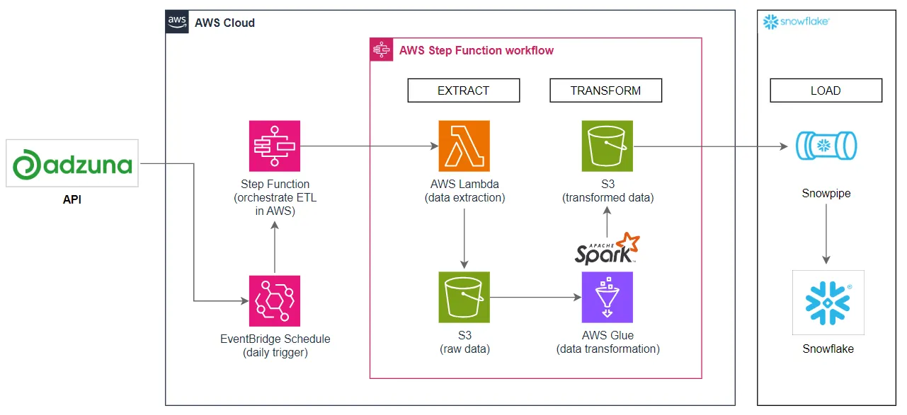

# Adzuna Jobs ETL Pipeline (AWS + Snowflake)

## 📌 Project Overview
This project implements an **end-to-end Data Engineering ETL pipeline** that ingests job postings from the **Adzuna Jobs API**, stores raw JSON in **Amazon S3**, transforms it with **AWS Glue (Spark)**, and continuously loads curated data into **Snowflake** using **Snowpipe**.

The pipeline is **serverless, automated, and cloud-native**, designed to scale with data volume. It demonstrates how to build a **real-world production-ready ETL system** using modern cloud services.

---

## 🎯 Main Focus
- **Data Engineering best practices**: raw → curated → warehouse zones  
- **Automation**: end-to-end workflow with Step Functions + EventBridge  
- **Real-time loading**: using Snowflake Snowpipe for continuous ingestion  
- **Scalability**: serverless compute with Lambda & Glue (Spark)  

---

## ✅ Benefits of this Project
- **Hands-on Cloud Data Engineering**: Covers the full cycle from API → Storage → Transformation → Warehouse  
- **Analytics-ready dataset**: Job postings data available in Snowflake for querying/reporting  
- **Reusability**: Framework can be adapted for any public API, not just Adzuna  
- **Cost-efficient**: Serverless components (Lambda, Glue, Snowpipe) mean you only pay per use  

---

## 🏗️ Architecture



1. **EventBridge** → Daily schedule trigger  
2. **Step Functions** → Orchestrates ETL steps  
3. **Lambda (Python 3.12 + requests layer)** → Extracts data from Adzuna API → Saves raw JSON to S3  
4. **Glue (Spark)** → Cleans/transforms → Writes curated data to S3  
5. **Snowpipe** → Auto-ingests transformed data into Snowflake  

---

## 🧰 Tech Stack
- **Source:** Adzuna Jobs API  
- **AWS:** Lambda, S3, Glue (Spark), Step Functions, EventBridge  
- **Warehouse:** Snowflake + Snowpipe  
- **Language:** Python 3.12 (`requests` for API), PySpark for Glue  

---

## 🚀 Complete Setup Guide

### 1. Clone Repository
```bash
git clone https://github.com/hameed980/Adzuna-ETL-pipeline-AWS-and-Snowflake.git
cd adzuna-etl-pipeline
